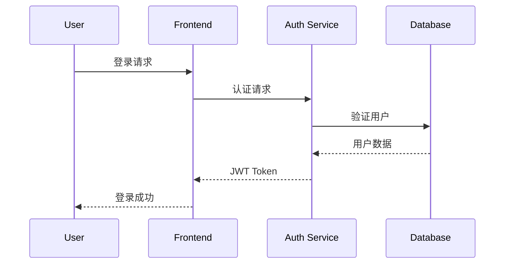
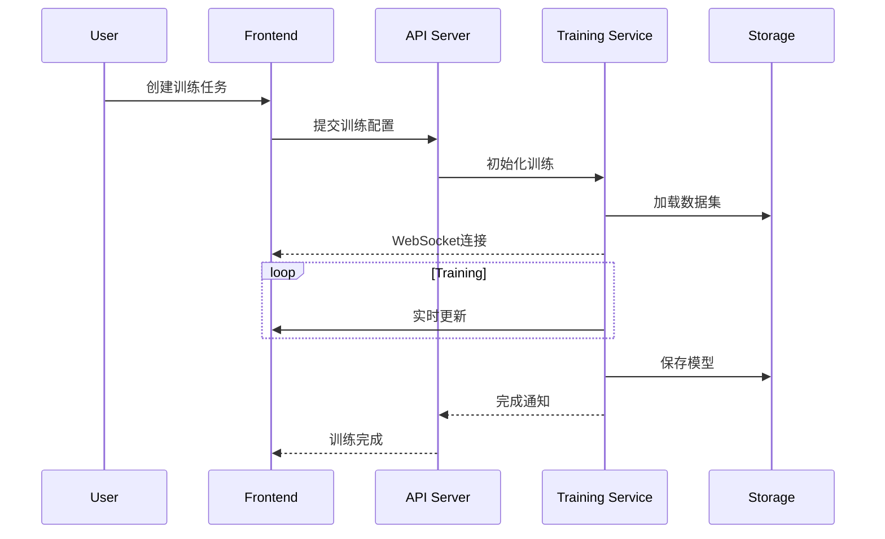

# NNLab 技术架构文档

## 系统架构

NNLab采用前后端分离的微服务架构，主要包含以下几个核心组件：

### 1. 前端应用 (Frontend)

#### 技术选型
- React 18
- TypeScript 5.0+
- Redux Toolkit
- Material-UI
- D3.js/Three.js

#### 主要模块
- 用户界面（UI）组件
- 状态管理
- 数据可视化
- WebSocket实时通信
- 路由管理

### 2. 后端服务 (Backend)

#### 技术选型
- Python 3.8+
- FastAPI
- PyTorch
- SQLAlchemy
- Redis

#### 主要模块
- RESTful API
- WebSocket服务
- 神经网络引擎
- 数据处理服务
- 认证授权服务

### 3. 数据存储

#### 主数据库
- PostgreSQL
  - 用户数据
  - 模型元数据
  - 训练记录

#### 缓存层
- Redis
  - 会话管理
  - 实时数据缓存
  - 任务队列

#### 文件存储
- MinIO/S3
  - 模型权重文件
  - 训练数据集
  - 用户上传文件

## 系统流程

### 1. 用户认证流程



### 2. 模型训练流程



## 代码组织

### 前端代码结构

```
frontend/
├── src/
│   ├── components/          # 可复用组件
│   │   ├── common/         # 通用组件
│   │   ├── network/        # 网络相关组件
│   │   └── visualization/  # 可视化组件
│   ├── pages/              # 页面组件
│   ├── store/              # Redux状态管理
│   │   ├── slices/        # Redux切片
│   │   └── hooks/         # 自定义Hooks
│   ├── services/           # API服务
│   ├── utils/              # 工具函数
│   └── types/              # TypeScript类型定义
└── public/                 # 静态资源
```

### 后端代码结构

```
backend/
├── api/                    # API定义
│   ├── v1/                # API版本1
│   └── endpoints/         # API端点
├── core/                  # 核心功能
│   ├── config/           # 配置管理
│   ├── security/         # 安全相关
│   └── database/         # 数据库配置
├── models/                # 数据模型
│   ├── domain/           # 领域模型
│   └── schemas/          # Pydantic模型
├── services/             # 业务服务
│   ├── network/          # 神经网络服务
│   └── training/         # 训练服务
└── utils/                # 工具函数
```

## 安全设计

### 1. 认证与授权
- JWT基础认证
- OAuth2.0社交登录
- RBAC权限控制

### 2. 数据安全
- HTTPS传输加密
- 敏感数据加密存储
- 定期数据备份

### 3. API安全
- 请求速率限制
- CORS配置
- 输入验证

## 性能优化

### 1. 前端优化
- 代码分割
- 懒加载
- 资源压缩
- 缓存策略

### 2. 后端优化
- 数据库索引
- 查询优化
- 缓存策略
- 异步处理

### 3. 网络优化
- CDN加速
- WebSocket长连接
- HTTP/2支持

## 监控告警

### 1. 系统监控
- CPU/内存使用率
- 磁盘I/O
- 网络流量

### 2. 应用监控
- API响应时间
- 错误率
- 并发用户数

### 3. 业务监控
- 训练任务状态
- 模型性能指标
- 用户活跃度

## 部署架构

### 开发环境
- Docker Compose
- 本地开发工具链
- 测试数据库

### 测试环境
- Kubernetes集群
- CI/CD流水线
- 自动化测试

### 生产环境
- 多区域部署
- 负载均衡
- 自动扩缩容
- 灾备方案 